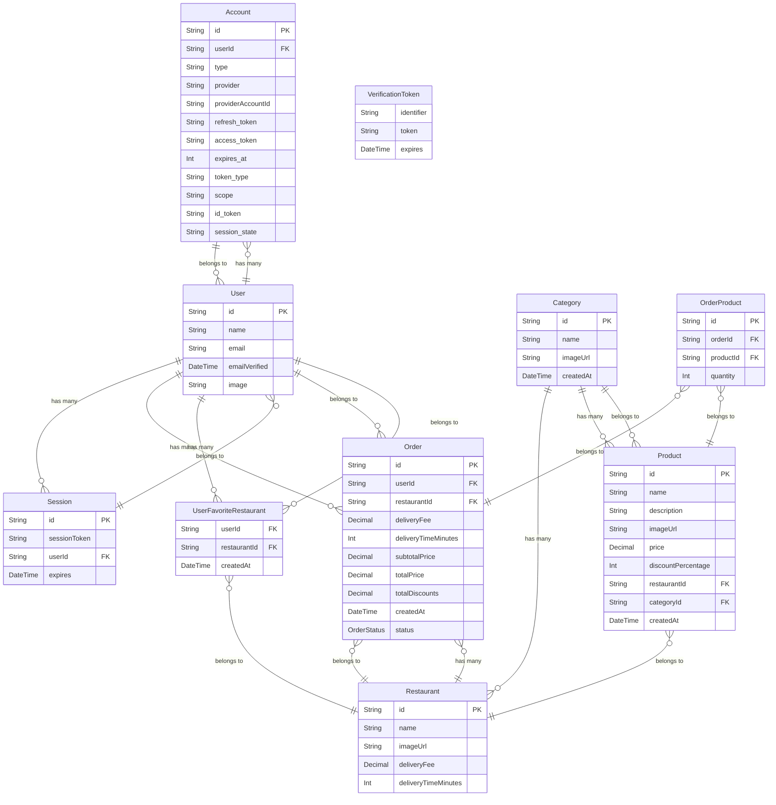

# FSW Foods

Este é um projeto de pedidos que segue a mesma logica do ifood onde é possivel realizar pedidos, favoritar restaurantes e realizar login com o Google. Projeto criado no evento **FullStack Week** do Felipe Rocha e sendo evoluido com novas funcionalidades por mim.

## Funcionalidades

- Realizar Pedidos
- Favoritar Restaurantes
- Repetir um pedido finalizado
- Visualizar Histórico de pedidos
- Login com o Google

## Tecnologias Utilizadas

- **Node.js**: Plataforma de servidor.
- **Prisma ORM**: ORM para interagir com o banco de dados NeonDB(Postgres).
- **NeonDB(Postgres)**: Banco de dados relacional.
- **Mermaid**: Para a visualização de diagramas.
- **NextJS**: Interface Visual(Front-End) com **Typescript**
- **TailwindCSS**: Para Estilização

## Estrutura do Projeto

A estrutura do banco de dados é composta pelos seguintes modelos:

- **User**: Representa um usuário do sistema.
- **Account**: Representa uma conta de autenticação de usuário.
- **Session**: Representa uma sessão de login de usuário.
- **VerificationToken**: Representa um token de verificação para autenticação de usuário.
- **Restaurant**: Representa um restaurante.
- **UserFavoriteRestaurant**: Representa a relação de um usuário com seus restaurantes favoritos.
- **Category**: Representa uma categoria de produtos.
- **Product**: Representa um produto de um restaurante.
- **OrderProduct**: Representa a relação entre um pedido e seus produtos.
- **Order**: Representa um pedido de um usuário.
- **OrderStatus**: Enumeração que representa o status de um pedido.

## Diagrama ER 

